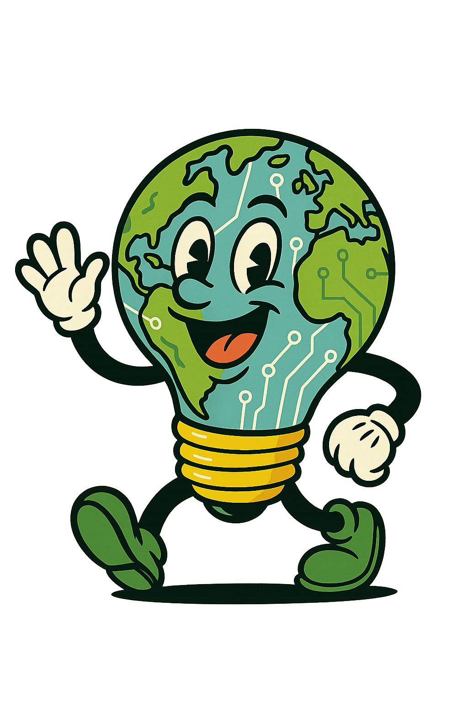

[](https://choosealicense.com/licenses/mit/)


# Agent IA avec LangChain : Transition Ecologique

## 📚 Sommaire

- [Présentation](#Présentation)
- [Fonctionnalités principales](#Fonctionnalités-principales)
- [🗂️ Structure du projet](#%EF%B8%8F-structure-du-projet)
- [Explication du code](#Explication-du-code)
- [Installation](#Installation)
- [Utilisation](#Utilisation)
- [🖼️ Screenshots](#%EF%B8%8F-screenshots)
- [👤 Auteurs](#-auteurs)
- [📄 Licence](#-licence)

## Présentation
Ce projet à but pédagogique vise à concevoir un assistant conversationnel intelligent, capable de répondre à des questions en langage naturel sur la base de documents publics, grâce aux outils *LangChain*. Il doit combiner une chaîne RAG pour la recherche documentaire, un agent IA pour exécuter des actions via des outils personnalisés, une mémoire conversationnelle pour maintenir le contexte, et une interface utilisateur fonctionnelle développée avec *Streamlit*.

Le projet a été réalisé par **Aurélien L.**, **Aurélien R.** et **Benjamin S.** dans le cadre de la formation *Développeur IA* chez *Simplon Hauts-de-France*.

Nous avons créé **Bulby**, un assistant intelligent spécialisé dans la transition écologique. Il aide les citoyens à comprendre les enjeux environnementaux, les réglementations, les aides financières et les bonnes pratiques, en s’appuyant principalement sur des documents internes, puis en dernier recours sur des recherches web actualisées.

## Fonctionnalités principales

- **Recherche documentaire** : Interroge une base de documents internes (lois, subventions, bonnes pratiques, etc.).
- **Recherche web** : Recherche d’informations à jour sur le web concernant la transition écologique.
- **Dialogue naturel** : Réponses claires et naturelles en français.
- **Respect de la véracité** : L’assistant ne fournit pas de réponses inventées. Si l’information n’est pas trouvée, il indique « Je ne sais pas. »

## 🗂️ Structure du projet

```
.
├── app/                # IA (agents, modèles, outils de recherche)
├── data/               # Données sources (csv, pdf, xls)
├── img/                # Images pour l’interface
├── interface/          # Interface utilisateur (Streamlit)
├── utils/              # Utilitaires (ex : intégration Chroma)
├── main.py             # Point d’entrée principal
├── requirements.txt    # Dépendances Python
└── README.md           # Ce fichier
```
## Explication du code
* [Chroma](document_README/chroma.md)
* [Interface Streamlit](document_README/streamlit.md)

## Installation

1. **Cloner le dépôt :**
   ```sh
   git clone https://github.com/Aurelien-L/AgentIA_TransitionEcologique.git
   ```

2. **Installer les dépendances :**
   ```sh
   pip install -r requirements.txt
   ```

3. **Lancer l’application :**
   ```sh
   streamlit run main.py
   ```

## Utilisation

- Accédez à l’interface web générée par Streamlit.
- Posez vos questions sur la transition écologique.
- L’assistant vous répond en s’appuyant sur les sources les plus pertinentes.


## 🖼️ Screenshots


## 👤 Auteurs
[ @aruide ](https://github.com/aruide)\
[ @Aurelien-L ](https://github.com/Aurelien-L)\
[ @benjsant ](https://github.com/benjsant)

## 📄 Licence

Ce projet est sous licence MIT. Voir le fichier LICENSE pour plus d'informations.

<div style="text-align: center;">
    
</div>